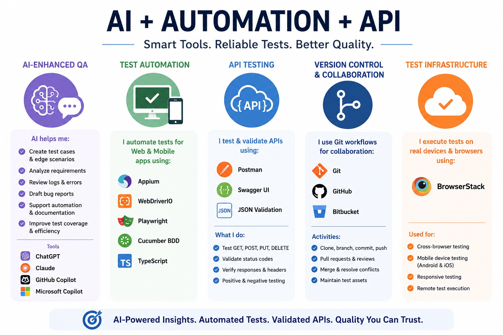

# AI, Automation & API Tools

## 🧠 AI-Enhanced Testing & Quality Engineering

I leverage AI-powered tools to improve testing efficiency, accelerate documentation, and support software quality activities throughout the Software Development Life Cycle (SDLC). AI helps streamline repetitive tasks, improve test coverage, and enhance productivity while maintaining human-driven validation and decision-making.

### How I Use AI in QA

- Generate functional, regression, exploratory, and edge-case test scenarios
- Analyze requirements, user stories, and acceptance criteria
- Draft and improve bug reports and defect summaries
- Review logs, error messages, and troubleshooting data
- Assist with automation script development and code reviews
- Generate SQL queries for data validation and testing activities
- Create technical documentation, user guides, and knowledge base articles
- Support risk analysis and test coverage reviews
- Accelerate research, root cause analysis, and debugging efforts
- Improve test coverage through AI-generated testing ideas
- Support QA planning and test strategy development

### AI Tools & Technologies

- ChatGPT
- Claude
- GitHub Copilot
- Microsoft Copilot
- Prompt Engineering
- AI-Enhanced Quality Engineering
- AI-Assisted Technical Documentation
- AI-Assisted Test Automation Development

### Example Prompt

```text
Generate positive, negative, and edge-case test scenarios for a password reset feature that includes CAPTCHA validation, email verification, account lockout protection, and session timeout handling.
```

### Example Use Cases

- Test case generation
- Test data creation
- Requirements analysis
- Documentation support
- Automation script assistance
- Defect triage and reporting

### Business Impact

- Accelerate test design and documentation activities
- Improve testing efficiency and coverage
- Reduce time spent on repetitive QA tasks
- Support faster defect analysis and troubleshooting
- Enhance collaboration between QA, Development, and Product teams

---

## 🤖 Test Automation

I develop and maintain automated test scripts for web and mobile applications using TypeScript-based automation frameworks.

### Automation Technologies

- Appium
- Appium Inspector
- WebDriverIO
- Playwright
- Cucumber BDD
- TypeScript

### Areas of Automation

- Mobile application testing (Android & iOS)
- Web application testing
- Functional validation
- Regression testing
- Cross-platform test execution
- Data-driven testing

### Sample Appium Code

```ts
const webviewOption = await $('android=new UiSelector().text("Views/WebView")');
await expect(webviewOption).toBeDisplayed();
```

---

## 🔌 API Testing & Validation

I perform API testing to validate service functionality, request and response behavior, and data integrity across REST-based applications.

### Tools Used

- Postman
- Swagger UI
- JSON Validation

### API Testing Activities

- GET, POST, PUT, DELETE request validation
- Status code verification
- Response body validation
- Header validation
- Error handling verification
- Positive and negative testing
- Request parameter validation

### Sample API Validation

```http
GET /api/products

Expected Result:
200 OK

Response:
JSON payload containing product data and metadata
```

### Portfolio Example

- Custom API developed using Wix Velo HTTP Functions
- GET and POST endpoint validation
- Postman collections
- Positive and negative API test cases
- JSON request and response verification
- Backend data validation using Wix CMS collections

---

## 🌿 Version Control & Collaboration

I use Git-based workflows to manage test automation projects and collaborate with development teams.

### Tools

- Git
- GitHub
- Bitbucket

### Activities

- Clone repositories
- Create feature branches
- Commit and push code changes
- Open and review pull requests
- Merge approved changes
- Resolve merge conflicts
- Maintain version-controlled test assets

### Example Workflow

```bash
git checkout -b feature/add-new-tests
git add .
git commit -m "Added login automation coverage"
git push origin feature/add-new-tests
```

---

## ☁️ Test Infrastructure & Cross-Platform Testing

I utilize cloud-based testing platforms to execute tests across multiple browsers, devices, and operating systems.

### Tools

- BrowserStack

### Activities

- Cross-browser testing
- Mobile device testing
- Responsive testing
- Remote test execution
- Platform compatibility validation
