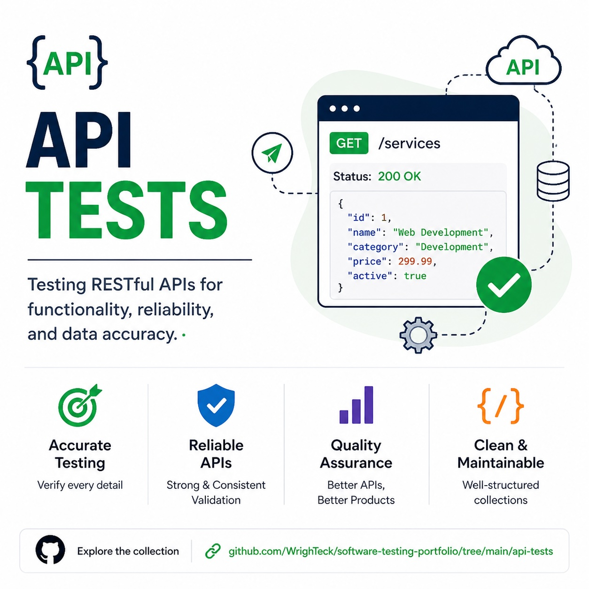

# API Tests

This section documents API testing performed using Postman against the WrighTeck API built with Wix Velo HTTP functions.

Endpoints tested include:

GET /_functions/health  
GET /_functions/services  
GET /_functions/cheat_sheets  
GET /_functions/guides  
GET /_functions/articles  

POST /_functions/contacts

## API Testing

This repository includes API testing examples located in `/api-tests`.

The API tests demonstrate:

• Endpoint validation  
• Request and response verification  
• Positive and negative API scenarios  
• Backend data verification

The APIs tested were created using Wix Velo HTTP functions and validated using Postman.

## Postman Collection

The Postman collection used to test the WrighTeck API is available here:

/api-tests/postman/wrighteck-api.postman_collection.json

This collection can be imported directly into Postman to execute the API tests.

Includes:

• API test cases  
• Postman testing workflow  
• Request/response validation examples
